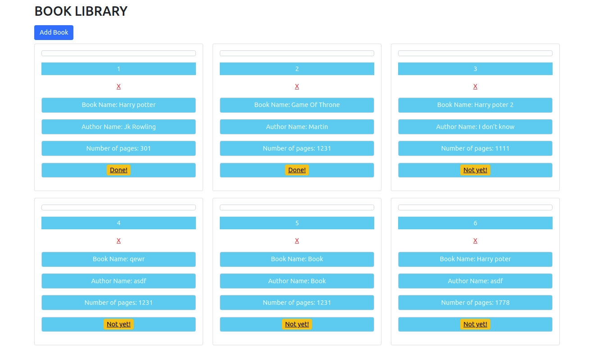

# Library - Javascript

> A simple Library App, where the user can add books information and view the registered books. Developed using: HTML, CSS, and Javascript.

### You can access a Live Demo [HERE](https://div685.github.io/JS-Library/)

## Features Built

- Register new Books
- Display list of Registered Books
- Remove Registered Books
- Change the status of registered books

## Built With

- HTML5
- CSS3
- Javascript
- Bootstrap

## Getting Started

To get a local copy up and running follow these simple steps.

- [ ] Open your terminal
- [ ]  Navigate to the directory where you will like to install the repo by running `cd FOLDER-NAME` 
- [ ] Clone this repository
 > `git clone https://github.com/Div685/JS-Library.git`
 - [ ] Open your browser
 - [ ] Open library/index.html

 
## Authors

👤 **Mian Faizan Ali Full Stack Programmer**

- GitHub: [@Faizanalifullstackprogrammer](https://github.com/Faizanalifullstackprogrammer)
- Twitter: [@mianfaizanali](https://twitter.com/mianfaizanali)
- LinkedIn: [Mianfaizanali](https://pk.linkedin.com/in/mianfaizanali)

## 🤝 Contributing

Contributions, issues and feature requests are welcome!

Feel free to connect anytime

## Show your support

Give a ⭐️ if you like this project!
